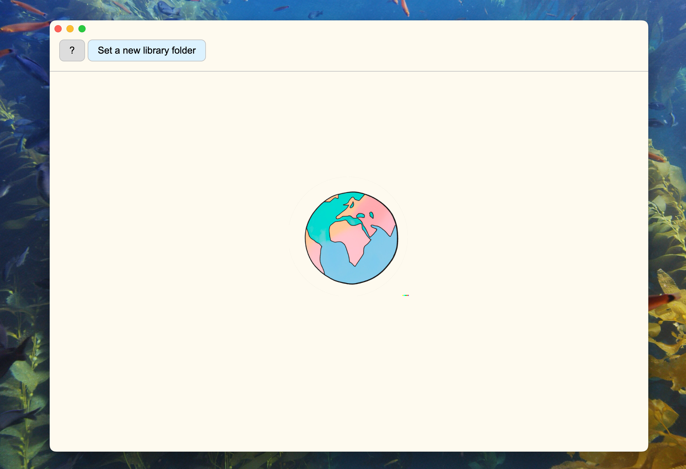
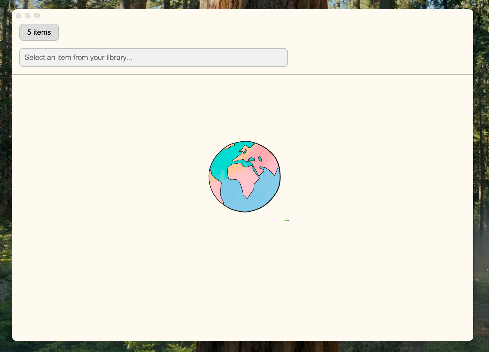
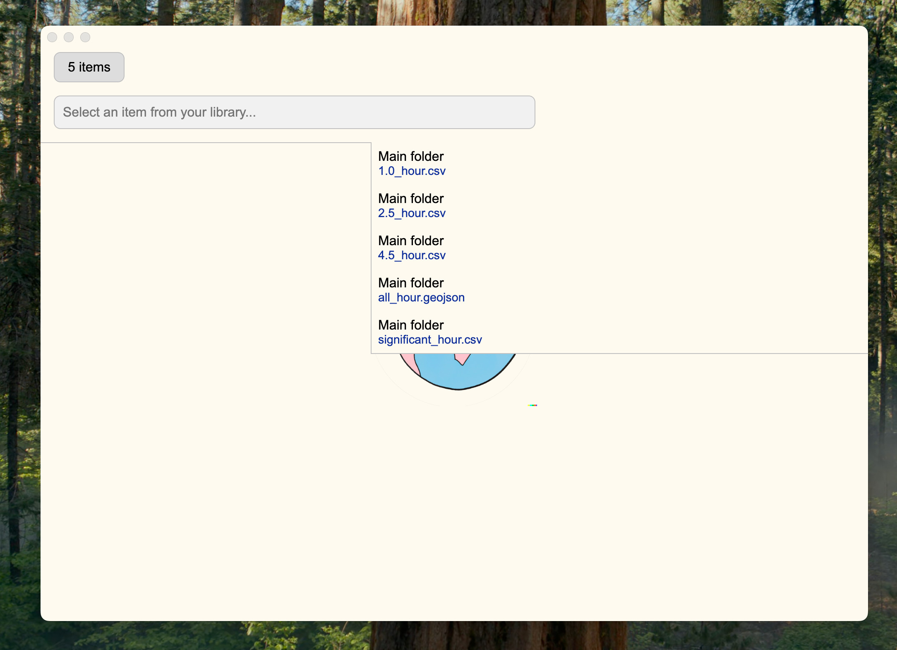
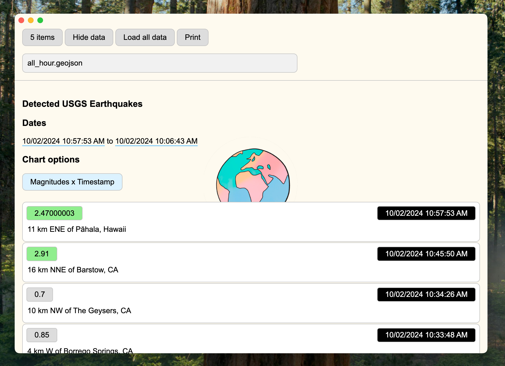
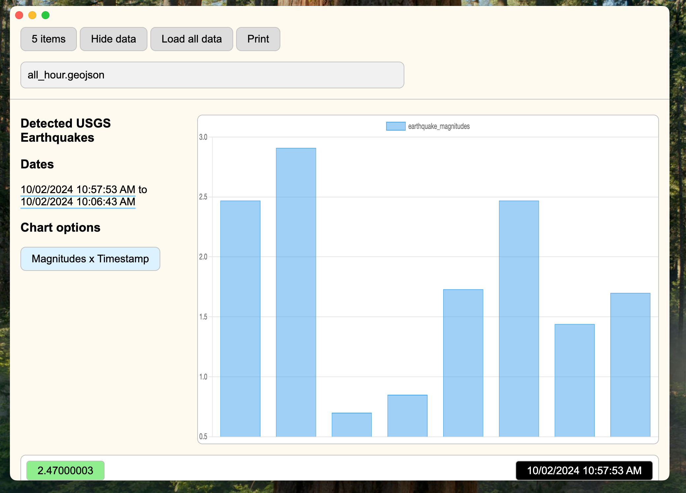

# Scientific Data App

This is the science data app refactored backup. It has the license of GNU GPLv3. It is provided AS-IS!

## Instructions to use:

```sh
# Install dependencies:
npm install
# Run the development version 
npm run start

```

## Instructions to build it:

```sh
# Builds the version of the package builder (Mac or Windows):
npm run build
```

## Visual details as screenshots:









